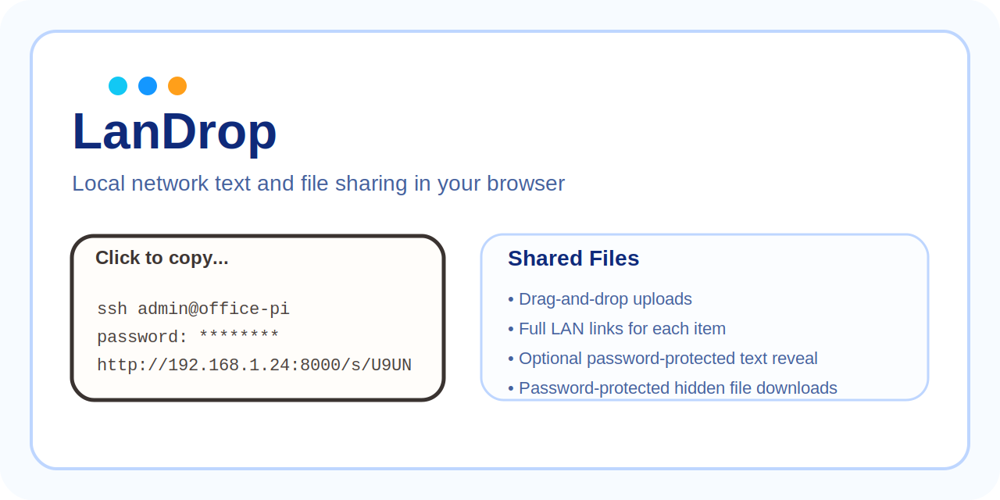
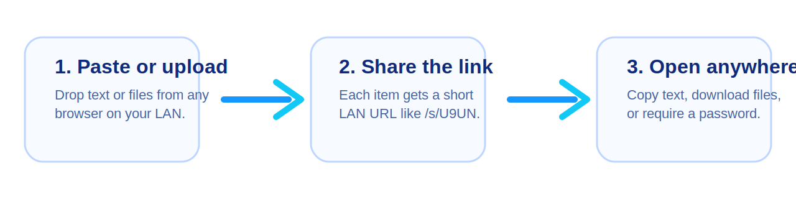
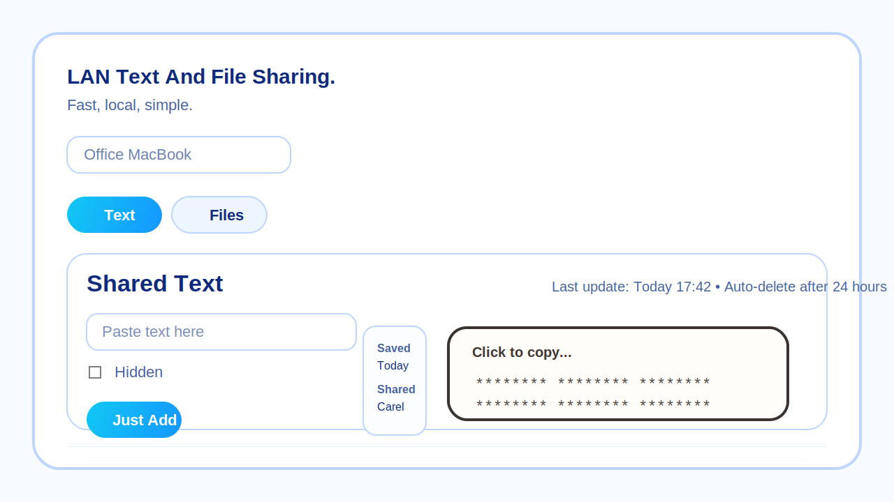
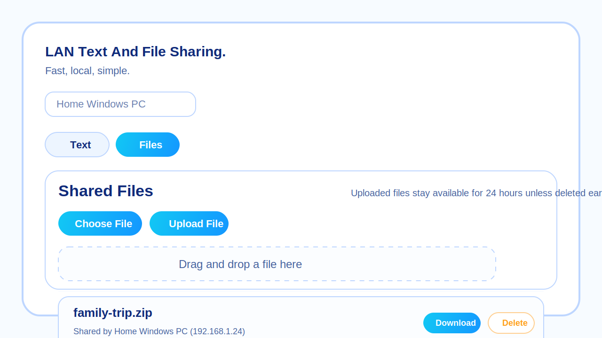

# LanDrop


Browser-based LAN file sharing and local network text sharing for fast device-to-device transfer.



LanDrop is a lightweight Python web app for sharing pasted text and uploaded files between browsers on the same local network. It works well as a local network clipboard sharing tool, a simple LAN file drop, and a quick browser-based transfer page for phones, tablets, laptops, desktops, and Raspberry Pi boxes.

It is especially useful at home when you want to move something between different operating systems without thinking about apps, cables, cloud sync, or accounts. Open the same page from Windows, macOS, Linux, iPhone, iPad, or Android on your own Wi-Fi and share text or files directly in the browser.



## Product Images

### Text Sharing



### File Sharing



## Why LanDrop

- Share text and files across your local network from any browser
- Move content easily between different operating systems on your own home network
- Generate direct LAN links for each item such as `http://192.168.1.24:8000/s/U9UN`
- Click any shared text card to copy it instantly
- Hide sensitive text and optionally require a password to reveal it
- Hide files behind a required password before download
- Automatically expire text and files after 24 hours
- Run with no external Python dependencies

## Use Cases

- Send a command, token, or SSH snippet from laptop to phone
- Move a photo, PDF, or download from a Windows PC to an iPhone or Android phone
- Paste a link or note on a Mac and open it on a Linux box across the room
- Drop a file onto a local network page and open it from another device
- Share a Wi-Fi password, API key, or login detail with temporary masking
- Run a simple self-hosted LAN file sharing page at home or in the office
- Use a browser as a local clipboard sync tool without cloud services

## Features

| Feature | Details |
| --- | --- |
| Local network text sharing | Paste text once and open it anywhere on your LAN |
| LAN file sharing | Upload files from the browser with drag-and-drop support |
| Short share links | Every item gets a short `/s/XXXX` link |
| Password protection | Hidden text can require a password, and hidden files always do |
| Fast copy workflow | Shared text cards are clickable and copy directly |
| Auto cleanup | Items expire after 24 hours |
| Access gate | Optional global access code for the whole app |
| Simple deployment | Run directly or install as an Ubuntu `systemd` service |

## Great For Mixed Devices At Home

LanDrop is built for the common home setup where devices do not all use the same operating system. If you have a Windows laptop, a MacBook, a Linux desktop, an iPhone, and an Android tablet on the same network, they can all use the same LanDrop page immediately.

Because everything runs in the browser over your own LAN, there is no need to install matching client apps on every device. That makes it useful for quick household sharing, moving text between workstations, sending downloads to phones, or opening a file from a spare machine in another room.

## Quick Start

Run LanDrop:

```bash
./.venv/bin/python app.py
```

Then open:

```text
http://127.0.0.1:8000
```

From other devices on the same network:

```text
http://<this-machine-ip>:8000
```

## Protect The App With An Access Code

```bash
ACCESS_CODE=my-secret-code ./.venv/bin/python app.py
```

## Configure The LAN Link Address

By default, LanDrop shows share links using the browser's current origin. If you want every shared text or file link to use a specific address, set `SHARE_BASE_URL`.

Example:

```bash
SHARE_BASE_URL=http://192.168.1.24:8000 ./.venv/bin/python app.py
```

This is useful when:

- you want all devices in your home to see the same fixed LAN address
- LanDrop is behind a reverse proxy
- you do not want links generated from `127.0.0.1` on the host machine

## Test

```bash
./.venv/bin/python -m unittest -v test_app.py
```

## API

| Endpoint | Purpose |
| --- | --- |
| `GET /api/state` | Full current history snapshot |
| `GET /api/latest-text` | Newest text entry as JSON |
| `POST /api/share-text` | Share plain text with a compact automation-friendly JSON response |
| `POST /api/text/<id>/reveal` | Reveal password-protected hidden text |
| `GET /api/latest-file` | Newest file metadata as JSON |
| `GET /api/latest-file/content` | Download the newest file |
| `POST /api/share-file` | Upload a file with a compact automation-friendly JSON response |
| `GET /download/<id>` | Download a file by item id |
| `GET /s/<code>` | Open a short LAN link for text or file |

Bash examples for the API are in [docs/bash-api.md](docs/bash-api.md).

## Install As An Ubuntu Service

Run the installer as `root` on the target Ubuntu server:

```bash
sudo bash ./install-ubuntu-service.sh
```

Or install or upgrade directly from GitHub on the target server:

```bash
curl -fsSL https://raw.githubusercontent.com/vossie/LanDrop/master/github-install-upgrade.sh | sudo bash
```

If the repository default branch is `main`, use:

```bash
curl -fsSL https://raw.githubusercontent.com/vossie/LanDrop/main/github-install-upgrade.sh | sudo bash
```

It will:

- create a system user and group named `landrop`
- install the app into `/opt/landrop`
- store uploads in `/var/lib/landrop/uploads`
- write config to `/etc/landrop/landrop.env`
- create and enable a `systemd` service that starts on boot

Override defaults during install:

```bash
sudo ACCESS_CODE=my-secret-code PORT=8080 bash ./install-ubuntu-service.sh
```

You can also set the share link base address during install:

```bash
sudo SHARE_BASE_URL=http://192.168.1.24:8000 bash ./install-ubuntu-service.sh
```

The GitHub helper also supports overrides, and on upgrade it reuses values from `/etc/landrop/landrop.env` unless you explicitly override them:

```bash
curl -fsSL https://raw.githubusercontent.com/vossie/LanDrop/master/github-install-upgrade.sh | sudo ACCESS_CODE=my-secret-code PORT=8080 bash
```

Useful service commands:

```bash
sudo systemctl status landrop
sudo systemctl restart landrop
sudo journalctl -u landrop -f
```

Uninstall while keeping uploads and the service user:

```bash
sudo bash ./uninstall-ubuntu-service.sh
```

Remove persisted uploads and the service account too:

```bash
sudo REMOVE_DATA=1 REMOVE_USER=1 bash ./uninstall-ubuntu-service.sh
```

## Notes

- Text history is stored in memory while the process is running.
- Uploaded files are stored in `uploads/`.
- Browsers poll for updates every 2 seconds.
- Maximum upload size is 1 GB.
- Expired files are removed automatically when the app is used.

## Search-Friendly Summary

If you are looking for a LAN file sharing tool, a browser-based local network file transfer app, a local clipboard sharing page, a cross-platform home network sharing tool, or a simple self-hosted text and file drop for devices on the same Wi-Fi network, LanDrop is built for that exact workflow.
