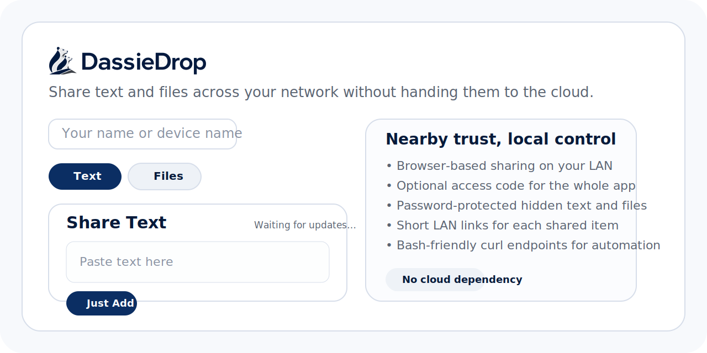
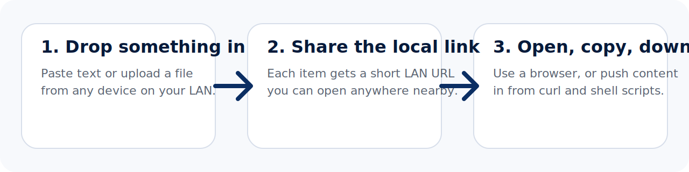
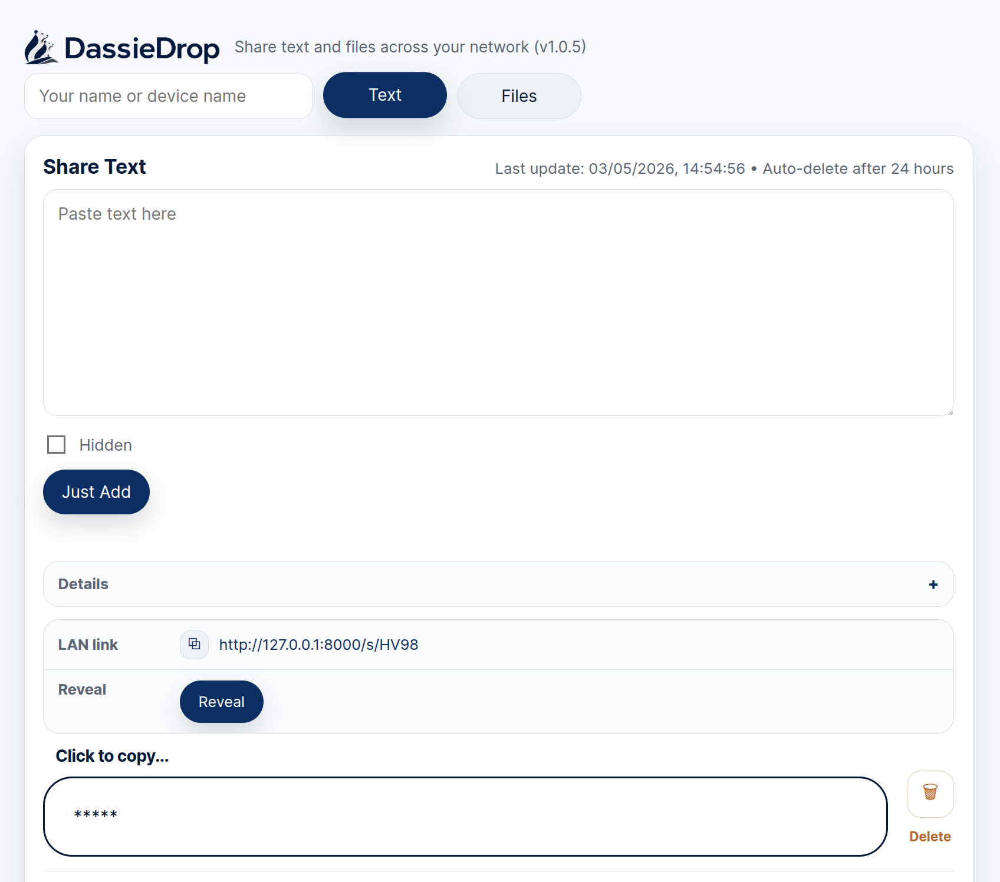
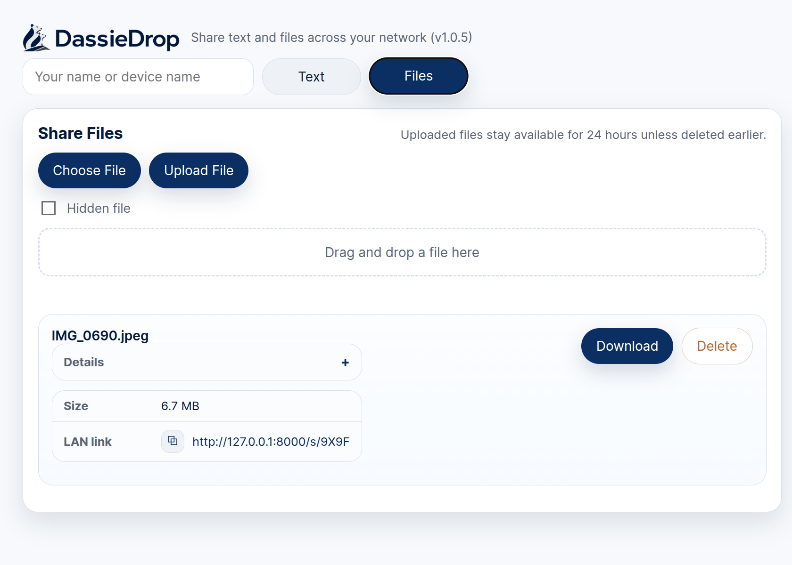

# DassieDrop


Real dassies share the same “drop zone” for generations.
DassieDrop does the same thing, except ours transfers files instead of creating a wildlife documentary problem.

DassieDrop is a lightweight Python web app for sharing text and files across your own network. Open it in a browser, paste text or upload a file, and hand the result to another device on the same LAN. It also exposes simple HTTP endpoints for posting text and uploading files from bash with `curl`.

The pitch is simple: if the job is moving data between devices you already control, you do not need a cloud service in the middle.



## Why It Exists

Most sharing tools quietly assume the internet should sit in the middle of everything. DassieDrop does not.

Your text and files stay on your hardware and your local network instead of being handed to a vendor account, retention policy, analytics pipeline, or third-party server you are expected to trust. That makes it useful for quick browser-to-browser sharing, mixed-device households, home labs, and small private networks where speed and control matter more than “platform.”

DassieDrop is especially good at:

- moving text and files between Windows, macOS, Linux, iPhone, iPad, and Android devices on the same network
- handing data from a Linux shell script or server to a phone or laptop with `curl`
- keeping local transfers simple, visible, and under your control



## Product Views

### Text Sharing



### File Sharing



## Why The Name Works

Dassies are highly social animals. They live in groups, communicate constantly, stay close to their community, and share safe spaces together. That makes them a surprisingly good metaphor for nearby trust and lightweight local sharing.

DassieDrop is about:

- Fast local communication
- Trust within a shared environment
- Lightweight movement between nearby devices
- Community over cloud dependency

## Why DassieDrop

- Share text and files across your local network from any browser
- Share text and files from bash or shell scripts with simple `curl` commands
- Keep text and files on infrastructure you control instead of a third-party cloud
- Know exactly where your data is while it is being shared
- Move content easily between different operating systems on your own home network
- Generate direct LAN links for each item such as `http://192.168.1.24:8000/s/U9UN`
- Click any shared text card to copy it instantly
- Hide sensitive text and optionally require a password to reveal it
- Hide files behind a required password before download
- Automatically expire text and files after 24 hours
- Run with no external Python dependencies

## Use Cases

- Send a command, token, or SSH snippet from laptop to phone
- Post a deploy URL, one-time code, or log snippet from a Linux server to a phone with `curl`
- Move a photo, PDF, or download from a Windows PC to an iPhone or Android phone
- Paste a link or note on a Mac and open it on a Linux box across the room
- Drop a file onto a local network page and open it from another device
- Share a Wi-Fi password, API key, or login detail with temporary masking
- Run a simple self-hosted LAN file sharing page at home or in the office
- Use a browser as a local clipboard sync tool without cloud services

## Features

| Feature | Details |
| --- | --- |
| Local network text sharing | Paste text once and open it anywhere on your LAN |
| LAN file sharing | Upload files from the browser with drag-and-drop support |
| Bash and curl sharing | Post text or upload files from shell scripts with compact JSON responses |
| Short share links | Every item gets a short `/s/XXXX` link |
| Password protection | Hidden text can require a password, and hidden files always do |
| Fast copy workflow | Shared text cards are clickable and copy directly |
| Auto cleanup | Items expire after 24 hours |
| Access gate | Optional global access code for the whole app |
| Simple deployment | Run directly, install as an Ubuntu `systemd` service, or run in Docker |

## Copyright And License

Copyright © 2026 DassieDrop contributors.

DassieDrop is released under the ISC License. See [LICENSE](LICENSE) for the full license text.

## Quick Start

Run DassieDrop:

```bash
./.venv/bin/python app.py
```

Then open:

```text
http://127.0.0.1:8000
```

From other devices on the same network:

```text
http://<this-machine-ip>:8000
```

## Protect The App With An Access Code

```bash
ACCESS_CODE=my-secret-code ./.venv/bin/python app.py
```

## Run With Docker

Build the image locally:

```bash
docker build -t dassiedrop .
```

Run it with a persistent volume for uploads:

```bash
docker run -d \
  --name dassiedrop \
  -p 8000:8000 \
  -e ACCESS_CODE=my-secret-code \
  -e SHARE_BASE_URL=http://192.168.1.24:8000 \
  -v dassiedrop-data:/data \
  dassiedrop
```

Then open:

```text
http://127.0.0.1:8000
```

The container stores uploaded files in the named volume at `/data/uploads`.

If you prefer Compose:

```bash
ACCESS_CODE=my-secret-code SHARE_BASE_URL=http://192.168.1.24:8000 docker compose up -d
```

The included [docker-compose.yml](/home/carel/IdeaProjects/bronzegate/DassieDrop/docker-compose.yml) maps host port `8000` to the app, keeps uploads in a named volume, and restarts the container automatically.

## Configure The LAN Link Address

By default, DassieDrop shows share links using the browser's current origin. If you want every shared text or file link to use a specific address, set `SHARE_BASE_URL`.

Example:

```bash
SHARE_BASE_URL=http://192.168.1.24:8000 ./.venv/bin/python app.py
```

This is useful when:

- you want all devices in your home to see the same fixed LAN address
- DassieDrop is behind a reverse proxy
- you do not want links generated from `127.0.0.1` on the host machine

## Test

```bash
./.venv/bin/python -m unittest -v test_app.py
```

## API

| Endpoint | Purpose |
| --- | --- |
| `GET /api/state` | Full current history snapshot |
| `GET /api/latest-text` | Newest text entry as JSON |
| `POST /api/share-text` | Share plain text with a compact automation-friendly JSON response |
| `POST /api/text/<id>/reveal` | Reveal password-protected hidden text |
| `GET /api/latest-file` | Newest file metadata as JSON |
| `GET /api/latest-file/content` | Download the newest file |
| `POST /api/share-file` | Upload a file with a compact automation-friendly JSON response |
| `GET /download/<id>` | Download a file by item id |
| `GET /s/<code>` | Open a short LAN link for text or file |

Bash examples for the API are in [docs/bash-api.md](docs/bash-api.md).
Developer and release workflow notes are in [docs/developer-guide.md](docs/developer-guide.md).

## Bash And Curl Sharing

DassieDrop is not only a browser page. It also works as a simple LAN sharing endpoint for shell scripts and servers.

Share plain text from bash:

```bash
curl -sS \
  -H 'Content-Type: application/json' \
  -X POST \
  -d '{"text":"deploy complete","name":"server"}' \
  http://127.0.0.1:8000/api/share-text
```

Upload a file from bash:

```bash
curl -sS \
  -X POST \
  -F 'file=@./report.txt' \
  -F 'name=server' \
  http://127.0.0.1:8000/api/share-file
```

Both return compact JSON including a short LAN share URL. More examples are in [docs/bash-api.md](docs/bash-api.md).

If the app uses `ACCESS_CODE`, bash clients can send it directly as `X-API-Key` instead of creating a login session first.

## Install As An Ubuntu Service

Run the installer as `root` on the target Ubuntu server:

```bash
sudo bash ./install-ubuntu-service.sh
```

Quick install from the command line with download, permissions, and run:

```bash
curl -fsSLo github-ubuntu-install-upgrade.sh https://raw.githubusercontent.com/vossie/DassieDrop/master/github-ubuntu-install-upgrade.sh
chmod +x github-ubuntu-install-upgrade.sh
sudo ./github-ubuntu-install-upgrade.sh
```

Or install or upgrade directly from GitHub on the target server:

```bash
curl -fsSL https://raw.githubusercontent.com/vossie/DassieDrop/master/github-ubuntu-install-upgrade.sh | sudo bash
```

If the repository default branch is `main`, use:

```bash
curl -fsSL https://raw.githubusercontent.com/vossie/DassieDrop/main/github-ubuntu-install-upgrade.sh | sudo bash
```

It will:

- create a system user and group named `dassiedrop`
- install the app into `/opt/dassiedrop`
- store uploads in `/var/lib/dassiedrop/uploads`
- write config to `/etc/dassiedrop/dassiedrop.env`
- create and enable a `systemd` service that starts on boot

Override defaults during install:

```bash
sudo ACCESS_CODE=my-secret-code PORT=8080 bash ./install-ubuntu-service.sh
```

Or use the explicit setup flag:

```bash
sudo bash ./install-ubuntu-service.sh --port 8080
```

You can also set the share link base address during install:

```bash
sudo SHARE_BASE_URL=http://192.168.1.24:8000 bash ./install-ubuntu-service.sh
```

The GitHub helper also supports overrides, and on upgrade it reuses values from `/etc/dassiedrop/dassiedrop.env` unless you explicitly override them:

```bash
curl -fsSL https://raw.githubusercontent.com/vossie/DassieDrop/master/github-ubuntu-install-upgrade.sh | sudo ACCESS_CODE=my-secret-code PORT=8080 bash
```

Use the Ubuntu service install when you want a native host deployment with `systemd`. Use Docker when you want a more portable containerized runtime with volume-backed uploads.

## Install On CentOS Stream From GitHub

Install or upgrade directly on a CentOS Stream host:

```bash
curl -fsSL https://raw.githubusercontent.com/vossie/DassieDrop/master/github-centos-stream-install-upgrade.sh | sudo bash
```

If the repository default branch is `main`, use:

```bash
curl -fsSL https://raw.githubusercontent.com/vossie/DassieDrop/main/github-centos-stream-install-upgrade.sh | sudo bash
```

The CentOS Stream helper installs required packages with `dnf`, upgrades the runtime to `python3.11`, creates the same `dassiedrop` system user and `systemd` service, and reuses values from `/etc/dassiedrop/dassiedrop.env` on upgrade unless you explicitly override them.

Override defaults during install or upgrade:

```bash
curl -fsSL https://raw.githubusercontent.com/vossie/DassieDrop/master/github-centos-stream-install-upgrade.sh | sudo ACCESS_CODE=my-secret-code PORT=8080 bash
```

## Credits

- Developer: Carel Vosloo
- Contributor: Mark Levitt
