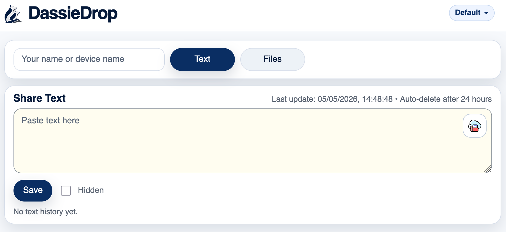
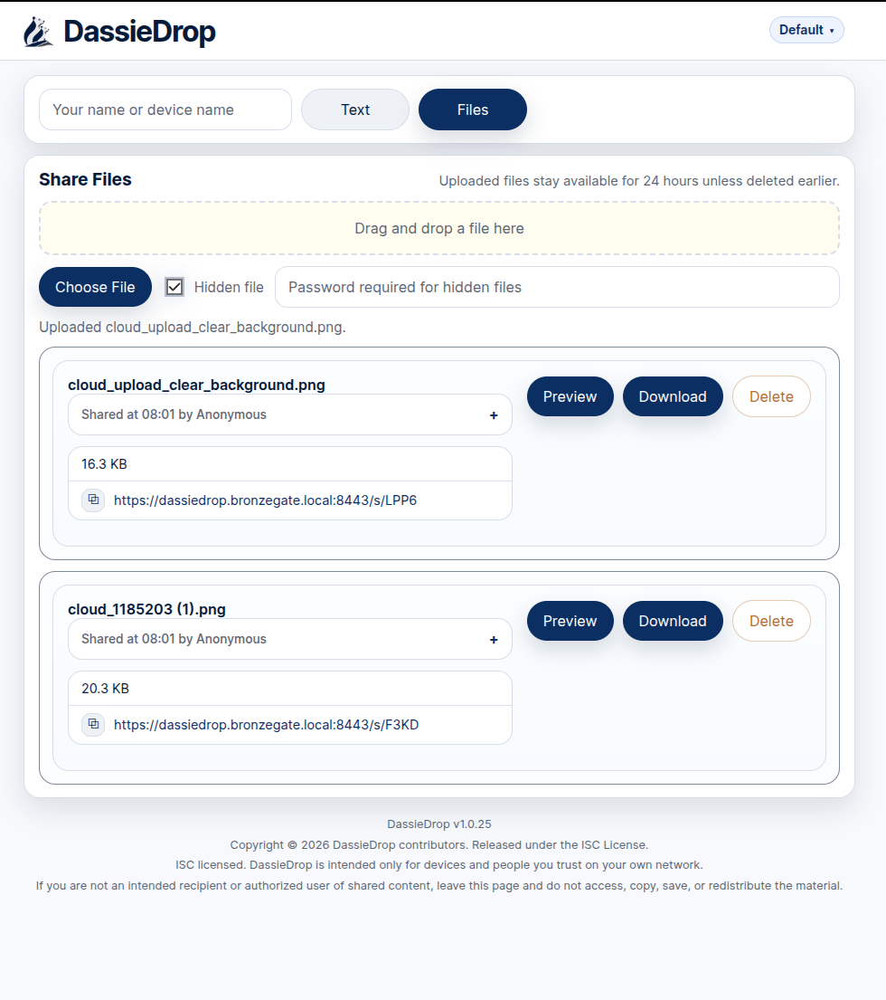
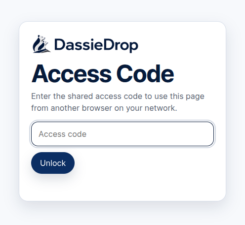
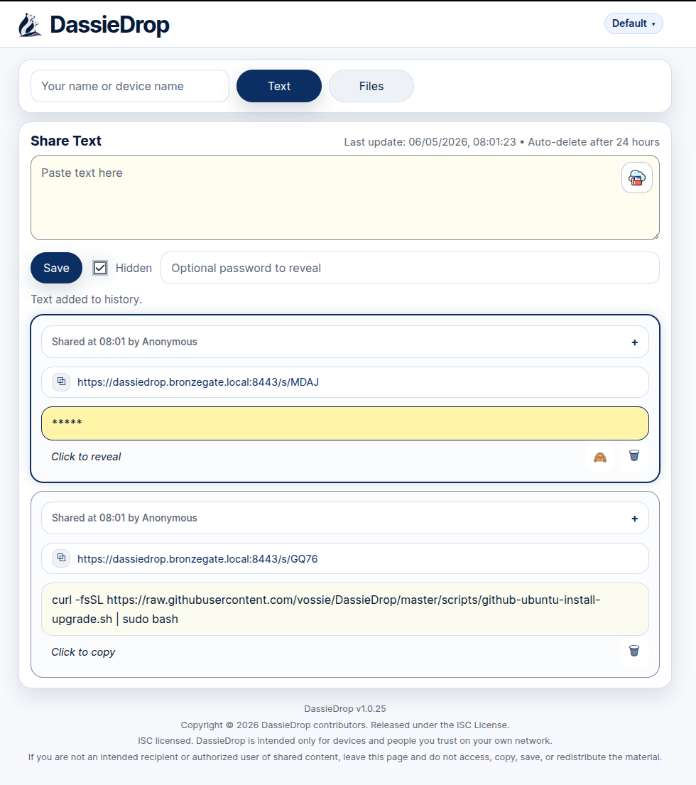
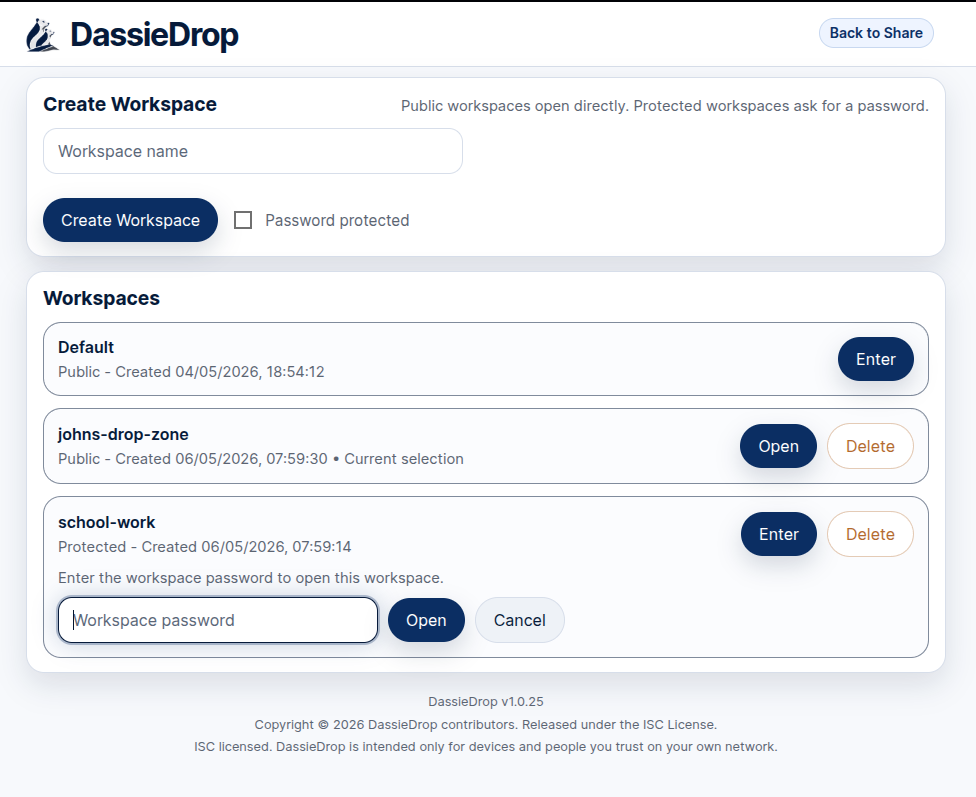

# DassieDrop

**Move files and text between your devices, privately, and without the cloud.**

DassieDrop is a lightweight, self-hosted LAN drop zone that lets you share files and clipboard-style text between:

- iPhone / iPad
- Android
- Linux
- Windows
- macOS

No accounts. No syncing. No third-party services. Just open a browser and drop.


---

## Why DassieDrop?

If you’ve ever:

- emailed yourself files just to move them
- used WhatsApp/Slack as a “clipboard”
- struggled getting files from iPhone → Linux
- avoided cloud tools for privacy/work reasons

This is for you.

---

## What makes it different

- Works on anything with a browser
- No cloud / no external services
- Instant sharing over your local network
- Supports both files and text snippets
- Dead simple, no setup, no accounts
- Scriptable via curl API

---

## Why not just use something else?

| Tool | Limitation |
|------|-----------|
| AirDrop | Apple-only |
| Dropbox / Drive / iCloud | Sends your data through the cloud |
| Email / WhatsApp / Slack | Awkward for quick transfers |
| USB sticks | Manual and slow |
| SCP / rsync | Not usable from phones |
| DassieDrop | Works everywhere via browser on your LAN |

---

## Quick Start

Run directly with Python:

```bash
git clone https://github.com/vossie/DassieDrop.git
cd DassieDrop
python3 app.py
```

Open in your browser:

http://127.0.0.1:8000

From another device on the same network:

http://YOUR-IP:8000

Run with Docker:

```bash
git clone https://github.com/vossie/DassieDrop.git
cd DassieDrop
docker build -t dassiedrop .
docker run -d --name dassiedrop -p 8000:8000 -v dassiedrop-data:/data dassiedrop
```

Then open:

http://127.0.0.1:8000

Docker also supports:

- native HTTPS on `8443`
- reverse-proxy TLS with the included Caddy setup

For HTTPS, Docker TLS options, service installs, and more setup details, see [docs/installation.md](docs/installation.md).

---

## Privacy & Security

DassieDrop is local-first by design:

- No internet required
- No third-party servers
- Files stay on your machine
- Auto-expiry (24h cleanup)
- Optional access code
- Optional hidden/password-protected items

Not intended to be exposed directly to the public internet without proper setup (reverse proxy + TLS).

---

## API

See [docs/api-usage.md](docs/api-usage.md) for API usage examples and quick automation notes.

---

## Use cases

- Move screenshots from iPhone → Linux instantly
- Send logs from a server → your phone
- Share config snippets between work and home machines
- Quick “clipboard sync” across devices
- Replace email/Slack as a file bridge

---

## Requirements

- Python 3.x
- No external dependencies

## Why not Flask?

DassieDrop intentionally uses only the Python standard library so it stays easy to run on locked-down machines.

---

## Installation

See full instructions in docs/installation.md

---

## Contributing

PRs welcome. Keep it simple, local-first, and dependency-free.

---

## Why “Dassie”?

Because it’s small, local, and surprisingly effective, like the rock hyrax.




